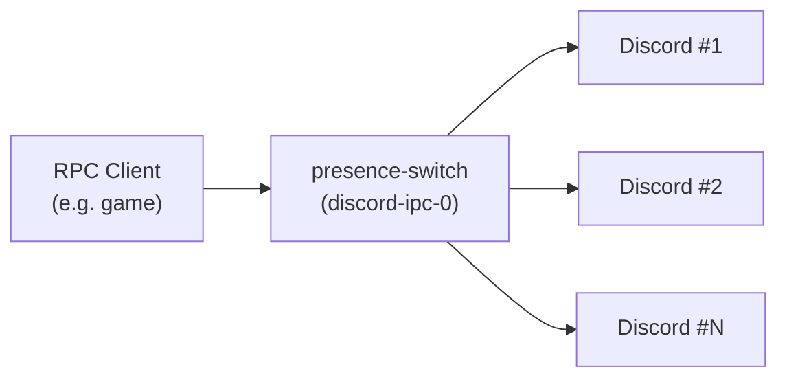

# presence-switch

A Discord Rich Presence IPC proxy that multiplexes RPC messages across multiple Discord instances.

## What it does

presence-switch sits between Discord RPC client applications (games, media players, etc.) and running Discord instances. It binds the first available `discord-ipc-{0..9}` socket (preferring `discord-ipc-0`) and relays all incoming RPC messages to every other existing Discord IPC socket.

This means a single RPC client can broadcast its presence to multiple Discord clients simultaneously.

## How it works



1. The switch claims an available `discord-ipc-*` socket name
2. RPC clients connect to the switch thinking it's Discord
3. The switch relays messages to all real Discord instances on other sockets

The IPC binary protocol uses a simple format: 4-byte LE opcode + 4-byte LE length + UTF-8 JSON payload. The switch processes handshake, ping, and close opcodes directly, and forwards all other opcodes (frame, pong) to Discord.

## Requirements

- Rust (edition 2024)
- One or more running Discord instances

## Building

```sh
cargo build --release
```

## Installing

Tagged releases publish `.rpm` and `.msi` builds to the [Releases](https://github.com/kramerc/presence-switch/releases) page. For unreleased changes, the [`Package`](.github/workflows/package.yml) workflow also produces dev artifacts on every push to `main` and every PR — download them from the workflow run's Artifacts section.

To build packages locally:

```sh
scripts/package.sh rpm   # → target/generate-rpm/presence-switch-*.rpm
scripts/package.sh msi   # → target/wix/presence-switch-*.msi (cross-compiled from Linux)
scripts/package.sh all
```

See `scripts/package.sh --help` for the toolchain requirements.

### Linux (Fedora/RHEL)

```sh
sudo dnf install ./presence-switch-*.rpm
systemctl --user daemon-reload
systemctl --user enable --now presence-switch
```

The package installs a per-user systemd unit at `/usr/lib/systemd/user/presence-switch.service`. View logs with `journalctl --user -u presence-switch`.

### Windows

Double-click the `.msi` to install per-user (no admin prompt). The installer adds an entry under `HKCU\Software\Microsoft\Windows\CurrentVersion\Run` so presence-switch launches at every logon — inspect or disable it via *Task Manager → Startup apps*. Uninstall via *Settings → Apps & features*.

## Usage

1. Close Discord or ensure `discord-ipc-0` is not taken
2. Run presence-switch:
   ```sh
   cargo run --release
   ```
3. Start your Discord instances — they will claim `discord-ipc-1`, `discord-ipc-2`, etc.
4. Launch your RPC-enabled application — it connects to presence-switch on `discord-ipc-0`, which relays to all Discord instances

For best results, start presence-switch before any Discord instances so it can claim `discord-ipc-0`, which is what most RPC clients connect to by default.

Press `Ctrl+C` to shut down gracefully.

## Platform support

| Platform | IPC mechanism       |
|----------|---------------------|
| Linux    | Unix domain sockets |
| macOS    | Unix domain sockets |
| Windows  | Named pipes         |

Platform-specific implementations are selected at compile time via `#[cfg]`.

## Project structure

```
src/
├── main.rs
├── switch/         # IPC server — accepts RPC client connections
│   └── ipc/
│       ├── mod.rs      # Server and Client logic
│       ├── unix.rs     # Unix domain socket listener
│       └── windows.rs  # Named pipe listener
└── discord/        # IPC client — connects to real Discord instances
    ├── api.rs          # Discord REST API for app metadata (cached)
    └── ipc/
        ├── mod.rs      # Client, protocol types, socket discovery
        ├── unix.rs     # Unix domain socket connection
        └── windows.rs  # Named pipe connection
```

## Releasing

To cut a new release:

1. Bump `version` in `Cargo.toml` (and run `cargo update -w` so `Cargo.lock` matches).
2. Commit the bump and merge to `main`.
3. Tag the commit on `main` matching the new version, e.g.:
   ```sh
   git tag v0.2.0
   git push origin v0.2.0
   ```
4. The [`Package`](.github/workflows/package.yml) workflow runs on the tag, validates that the tag matches `Cargo.toml`, builds the `.rpm` and `.msi`, and publishes a GitHub Release with both attached and auto-generated notes from the commits since the previous release.

If the tag version doesn't match `Cargo.toml`'s `version` field, both build jobs fail loudly before doing any work.

## License

[MIT](LICENSE) © Kramer Campbell
